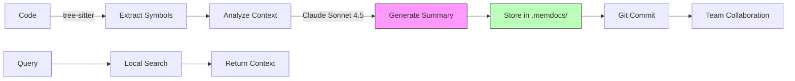

# MemDocs 🧠

<div align="center">

**Persistent Memory for AI Projects**

[](https://github.com/Smart-AI-Memory/memdocs/actions/workflows/ci.yml)
[](https://codecov.io/gh/Smart-AI-Memory/memdocs)
[](https://www.python.org/downloads/)
[](https://badge.fury.io/py/memdocs)
[](https://opensource.org/licenses/Apache-2.0)
[](https://github.com/psf/black)

[Features](#-key-features) •
[Quick Start](#-quick-start) •
[Documentation](#-documentation) •
[Examples](#-use-cases) •
[Contributing](CONTRIBUTING.md)

</div>

---

## 🎯 What is MemDocs?

**MemDocs** is a **git-native memory management system** that gives AI assistants persistent, project-specific memory. It generates structured, machine-readable documentation that lives in your repository—no cloud services, no recurring costs, just local/git-based storage that enhances AI context and team collaboration.

### 💡 The Problem

AI assistants like Claude **have no memory between sessions**. Every conversation starts from scratch, forcing you to repeatedly explain your codebase, architecture decisions, and project context.

### ✨ The Solution

MemDocs creates a **persistent memory layer** that:

- 🧠 **Remembers your project** across sessions (via `.memdocs/` directory)
- 👥 **Shares memory with your team** (committed to git)
- 💰 **Costs nothing to store** (no vector databases, no embeddings API)
- ⚡ **Works offline** (no cloud dependencies for retrieval)
- 🤝 **Integrates with Empathy Framework** (Level 4 Anticipatory Intelligence)
- 🔒 **Privacy-first** (optional PHI/PII detection and redaction)

---

## 🚀 Quick Start

### Installation

```bash
# From PyPI (recommended)
pip install memdocs

# With optional features
pip install memdocs[embeddings]  # Local vector search
pip install memdocs[all]         # All features

# From source
git clone https://github.com/Smart-AI-Memory/memdocs.git
cd memdocs
pip install -e ".[dev,embeddings]"
```

### Basic Usage

```bash
# 1. Set your Claude API key
export ANTHROPIC_API_KEY="your-key-here"

# 2. Initialize MemDocs in your project
cd your-project
memdocs init

# 3. Document a single file (recommended)
memdocs review --path src/payments/charge.py

# 4. Search your project memory
memdocs query "payment processing"

# 5. Show memory stats
memdocs stats
```

### Your First Documentation

```bash
# Document a specific file
memdocs review --path src/main.py

# Output:
# ✨ Analyzing src/main.py...
# 📝 Generating documentation with Claude Sonnet 4.5...
# ✅ Documentation saved to .memdocs/docs/main/
#    - index.json (machine-readable)
#    - symbols.yaml (code map)
#    - summary.md (human-readable)
```

---

## ✨ Key Features

### 🧠 Git-Native Memory

- All documentation stored in `.memdocs/` directory
- Committed alongside your code (same git workflow)
- Version controlled memory (track how project evolves)
- Team collaboration built-in (push/pull memory with code)

### 🎯 Smart Scoping

- **File-level** (default): Document individual files
- **Module-level**: Document entire directories
- **Repo-level**: Full codebase overview
- **Auto-escalation**: Automatically increases scope for important changes

### 🤖 AI-Powered Summarization

- **Claude Sonnet 4.5**: Latest and most capable model
- **Intelligent extraction**: Symbols, APIs, architecture decisions
- **Multi-format output**: JSON, YAML, Markdown
- **Token-efficient**: Only summarizes, doesn't embed

### 🔍 Semantic Search (Optional)

- **Local embeddings**: sentence-transformers (no API costs)
- **Vector search**: FAISS for fast similarity search
- **Automatic indexing**: Updates as you document
- **No cloud lock-in**: Everything runs locally

### 🔗 Empathy Framework Integration

- Works seamlessly with [Empathy](https://github.com/Deep-Study-AI/empathy) framework
- Supports Level 4 Anticipatory Empathy workflows
- Bidirectional sync (MemDocs ↔ Empathy)
- Trust-building behaviors powered by persistent memory

### 🔒 Privacy & Security

- **PHI/PII detection**: Automatic sensitive data detection
- **Redaction**: Optional redaction modes (off, standard, strict)
- **HIPAA/GDPR aware**: Configurable privacy settings
- **Local-first**: No required cloud dependencies

---

## 📖 Documentation

### Configuration

Create `.memdocs.yml` in your project root:

```yaml
version: 1

# Scope policy (controls memory granularity)
policies:
  default_scope: file          # file | module | repo
  max_files_without_force: 150

  # Auto-escalate for important changes
  escalate_on:
    - cross_module_changes      # Multi-module = bigger context
    - security_sensitive_paths  # auth/*, security/* = thorough docs
    - public_api_signatures     # API changes = team awareness

# Output configuration (git-committed memory)
outputs:
  docs_dir: .memdocs/docs       # Committed to git
  memory_dir: .memdocs/memory   # Committed to git
  formats:
    - json                      # index.json (machine-readable)
    - yaml                      # symbols.yaml (code map)
    - markdown                  # summary.md (human-readable)

# AI configuration (Claude API)
ai:
  provider: anthropic
  model: claude-sonnet-4-5-20250929  # Claude Sonnet 4.5 (latest)
  max_tokens: 8192
  temperature: 0.3              # Lower = more deterministic

# Privacy (optional, for sensitive codebases)
privacy:
  phi_mode: "off"               # off | standard | strict
  scrub:                        # Types of sensitive data to redact
    - email
    - phone
    - ssn
    - mrn
  audit_redactions: true        # Log all redactions for compliance

# Exclude patterns
exclude:
  - node_modules/**
  - .venv/**
  - __pycache__/**
  - "*.pyc"
  - dist/**
  - build/**
```

---

## 💼 Use Cases

### 1. Onboarding New Developers

```bash
# New team member clones repo
git clone <your-repo>
cd your-repo

# MemDocs memory already there!
memdocs query "authentication flow"
memdocs query "database schema"
```

**Result**: Instant context about the project without asking teammates.

### 2. AI Assistant Context

```python
from pathlib import Path
from memdocs.index import MemoryIndexer
import anthropic

# Get project context from MemDocs
indexer = MemoryIndexer(
    memory_dir=Path(".memdocs/memory"),
    use_embeddings=True  # Requires: pip install memdocs[embeddings]
)
results = indexer.query_memory("payment processing", k=5)

# Build context for Claude
context = "\n".join([r["metadata"]["summary"] for r in results])

# Claude now has project memory
client = anthropic.Anthropic()
response = client.messages.create(
    model="claude-sonnet-4-5-20250929",
    system=f"Project context:\n{context}",
    messages=[{"role": "user", "content": "Explain the charge flow"}]
)
```

**Result**: Claude remembers your project structure and decisions.

### 3. Code Review Preparation

```bash
# Before opening PR
memdocs review --path src/new-feature/

# MemDocs generates:
# - Feature summary
# - API changes
# - Breaking changes
# - Migration notes
```

**Result**: Reviewers get structured context automatically.

### 4. Empathy Framework Integration

```python
from memdocs.empathy_adapter import adapt_empathy_to_memdocs

# Empathy analysis results
analysis = {
    "current_issues": [...],
    "predictions": [...]
}

# Convert to MemDocs format
doc_index = adapt_empathy_to_memdocs(
    analysis,
    file_path="src/compliance/audit.py",
    memdocs_root=".memdocs"
)
```

**Result**: Level 4 Anticipatory Empathy powered by project memory.

---

## 🏗 Architecture

### Storage Structure

```
your-project/
├── .memdocs/
│   ├── docs/
│   │   ├── <filename>/
│   │   │   ├── index.json          # Machine-readable index
│   │   │   ├── symbols.yaml        # Code symbols/API map
│   │   │   └── summary.md          # Human-readable summary
│   └── memory/
│       ├── embeddings.json         # Optional: Local vector embeddings
│       └── search.index            # Optional: FAISS index
├── .memdocs.yml                    # Configuration
└── src/
    └── ... your code ...
```

### How It Works



1. **Extract**: tree-sitter parses code (Python, JS, TS, Go, Rust, etc.)
2. **Analyze**: Identifies symbols, imports, APIs, patterns
3. **Summarize**: Claude generates concise summaries with insights
4. **Store**: Saves structured docs in `.memdocs/` directory
5. **Retrieve**: Fast local search (grep-based or vector-based)

### Token Efficiency

- **Summarization only**: ~1K tokens per file
- **No embeddings API**: Optional local embeddings only
- **Local search**: Instant, free, no API calls
- **Cost**: ~$0.10 per 100 files documented

---

## 🔧 CLI Reference

### `memdocs init`

Initialize MemDocs in a project.

```bash
memdocs init [--force]
```

### `memdocs review`

Generate memory documentation.

```bash
# File-level (recommended)
memdocs review --path src/payments/charge.py

# Module-level
memdocs review --path src/payments/ --scope module

# With scope detection
memdocs review --path src/

# Export to Cursor
memdocs review --path src/ --export cursor
```

### `memdocs query`

Search project memory (requires embeddings).

```bash
memdocs query "authentication flow"
memdocs query "database schema" --k 10
```

### `memdocs stats`

Show memory statistics.

```bash
memdocs stats
memdocs stats --format json
```

### `memdocs export`

Export memory to other formats.

```bash
memdocs export --format cursor
memdocs export --format json --output memory.json
```

---

## 🔌 Integrations

### Model Context Protocol (MCP)

MemDocs includes an MCP server for Claude Desktop:

```json
{
  "mcpServers": {
    "memdocs": {
      "command": "memdocs",
      "args": ["mcp-server"],
      "cwd": "/path/to/your/project"
    }
  }
}
```

### Cursor Integration

```bash
# Export memory for Cursor
memdocs export --format cursor

# Cursor automatically picks up .memdocs/ directory
```

### Python API

```python
from memdocs.index import MemoryIndexer
from memdocs.summarize import Summarizer
from memdocs.extract import Extractor

# Initialize components
indexer = MemoryIndexer(memory_dir=".memdocs/memory", use_embeddings=True)
summarizer = Summarizer()
extractor = Extractor()

# Extract and document
context = extractor.extract_file("src/main.py")
doc_index, markdown = summarizer.summarize(context, scope_info)

# Index for search
indexer.index_document(doc_index, markdown)

# Query
results = indexer.query_memory("authentication", k=5)
```

---

## 📊 Comparison

| Feature | MemDocs | Vector DBs | GitHub Copilot | Cursor |
|---------|---------|------------|----------------|--------|
| **Storage** | Git-native | Cloud | Cloud | Cloud |
| **Monthly cost** | $0 | $$$ | $10-20 | $20 |
| **Team sharing** | ✅ Built-in | ⚠️ Separate | ❌ None | ❌ None |
| **Offline** | ✅ Yes | ❌ No | ❌ No | ❌ No |
| **Privacy** | ✅ Local | ⚠️ Cloud | ⚠️ Cloud | ⚠️ Cloud |
| **Memory persistence** | ✅ Permanent | ✅ Permanent | ❌ Session | ⚠️ Limited |
| **Empathy integration** | ✅ Native | ❌ No | ❌ No | ❌ No |
| **API calls** | Only for docs | Always | Always | Always |

---

## 🗺 Roadmap

See [PRODUCTION_ROADMAP.md](PRODUCTION_ROADMAP.md) for detailed 4-week production plan.

### Version 2.1 (Q1 2025)
- [ ] VS Code extension
- [ ] Enhanced CLI with rich output
- [ ] Incremental documentation updates
- [ ] Custom prompt templates

### Version 2.2 (Q2 2025)
- [ ] JetBrains plugin
- [ ] Multi-language support (Go, Rust, Java, C++)
- [ ] Memory compression (auto-summarize old docs)
- [ ] Team analytics dashboard

### Version 3.0 (Q3 2025)
- [ ] MemDocs Cloud (optional hosted version)
- [ ] Enterprise features (SSO, RBAC, audit logs)
- [ ] Advanced Empathy integration
- [ ] GitHub App for automatic PR documentation

---

## 🤝 Contributing

We welcome contributions! See [CONTRIBUTING.md](CONTRIBUTING.md) for guidelines.

**Quick links:**
- [Code of Conduct](CODE_OF_CONDUCT.md)
- [Security Policy](SECURITY.md)
- [Development Setup](CONTRIBUTING.md#development-setup)
- [Good First Issues](https://github.com/Smart-AI-Memory/memdocs/labels/good%20first%20issue)

**Key areas needing help:**
- Multi-language AST parsing (Go, Rust, Java, C++)
- IDE plugins (VS Code, JetBrains)
- Documentation improvements
- Example projects

---

## 📄 License

Apache License 2.0 - See [LICENSE](LICENSE) for details.

---

## 💬 Support & Community

- **Documentation**: Coming soon to https://docs.deepstudyai.com/memdocs
- **Issues**: [GitHub Issues](https://github.com/Smart-AI-Memory/memdocs/issues)
- **Discussions**: [GitHub Discussions](https://github.com/Smart-AI-Memory/memdocs/discussions)
- **Discord**: Coming soon
- **Email**: patrick.roebuck@deepstudyai.com

---

## 🙏 Acknowledgments

**Created by**: Patrick Roebuck ([Deep Study AI, LLC](https://deepstudyai.com))

**Powered by**:
- [Claude Sonnet 4.5](https://www.anthropic.com/claude) by Anthropic
- [tree-sitter](https://tree-sitter.github.io/tree-sitter/) for AST parsing
- [sentence-transformers](https://www.sbert.net/) for local embeddings
- [FAISS](https://github.com/facebookresearch/faiss) for vector search

**Special thanks** to:
- The Empathy Framework team
- Early adopters and beta testers
- The open-source community

---

<div align="center">

**🧠 MemDocs: Because AI should remember your project, not forget it every session.**

Made with ❤️ by [Deep Study AI](https://deepstudyai.com)

[Get Started](#-quick-start) • [View Examples](#-use-cases) • [Read Docs](#-documentation) • [Contribute](CONTRIBUTING.md)

</div>
